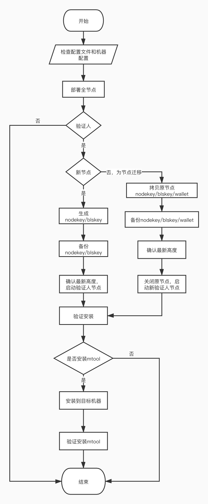

# ansible-for-platon

## 优化部署流程



## 自动化部署优势

- 自动化部署更高效。基 Platon 官方提供的自动化 shell 脚本，把手工操作部分用 Ansible 实现自动化，省去了手动切换多个目录，修改拷贝多个文件，设置对应密码，执行多个命令的步骤。
- 轻松易上手。执行一行命令，自动化生成整个节点运行配置文件，不懂 Ansible 的用户，也能轻松使用。
- 可实现对多个节点进行自动化批量操作。可用来部署私有链，或种子节点维护。
- 运维工作更清晰。预先在一个变量文件里编写好，方便执行前审查确认，执行后核对输出结果。
- 有效避免因手工操作产生的输入错误、执行顺序错误等问题。优化后的执行过程中设有一系列的前置检查，确保没有冲突的配置项。
- 支持多套部署环境，统一在 inventories 目录下进行管理。

## 运行依赖

- ansible 2.10+
- 操作机器：理论上可以跨平台，目前仅测试mac/linux机器
- 目标机器： Ubuntu 18.04

```bash
curl https://bootstrap.pypa.io/get-pip.py -o get-pip.py
sudo python get-pip.py
pip install --user -U -r requirements.txt
```

## TODO

- 部署全节点同步耗时过长，需要节点数据快照以加速安装
- 二进制版本发布源需官方地址提供支持
- 私有链部署

